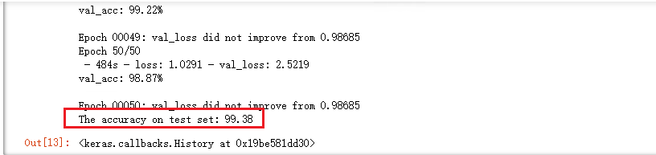

### System configuration
1. CPU: Intel(R) Xeon(R) Platinum 8170 CPU @ 2.10GHz
2. Memory: 64.0GB DDR4
3. GPU: NVIDIA Quadro P2000,  GPU Memory (5.0GB)
4. Windows Server 2019

### Software library
1. anaconda  (version 1.6.9)
2. numpy (1.12.1)
3. matplotlib (2.2.2)
4. keras-gpu (2.1.6)
5. pandas (0.23.1)
6. tensorflow-gpu (1.8.0)
7. tqdm (4.23.4)
8. opencv3 (3.1.0)
9. jupyter (4.4.0)
10. scikit-learn  (0.19.1)
11. seaborn  (0.9.0)

### Trianing time
	7.48 h

### Result

 

